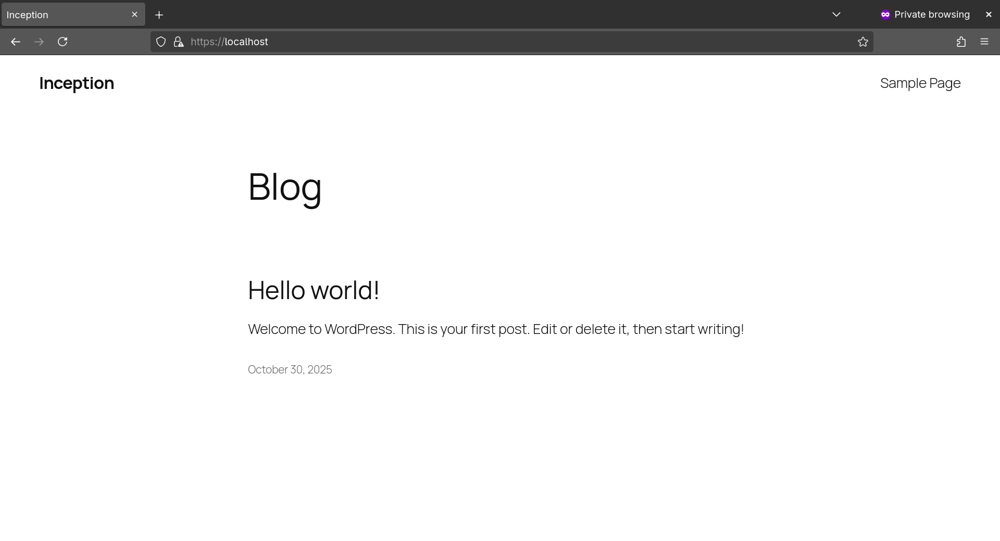
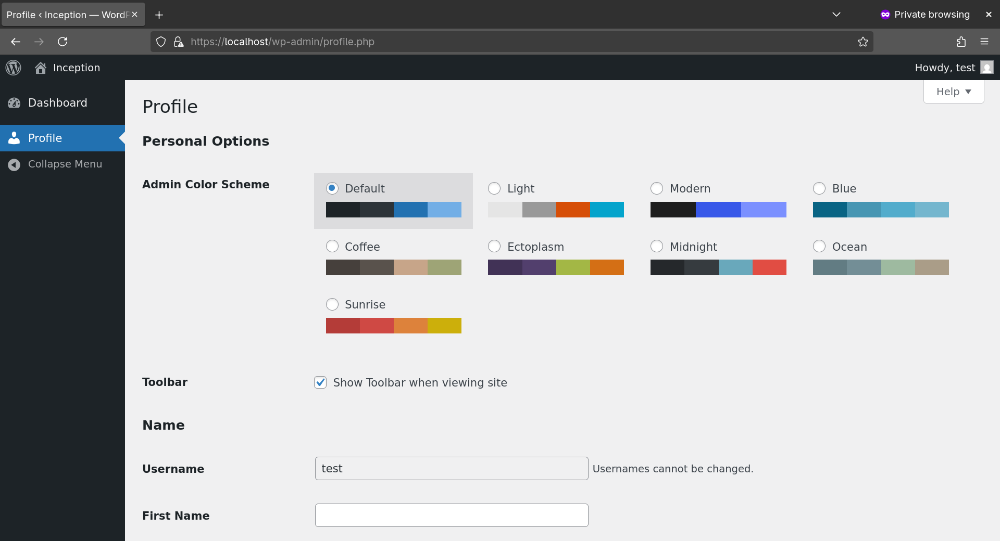
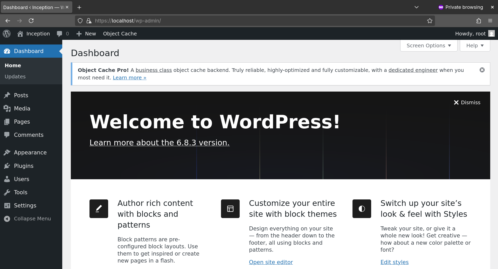
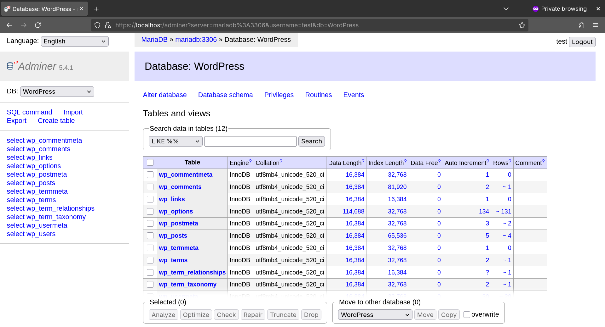
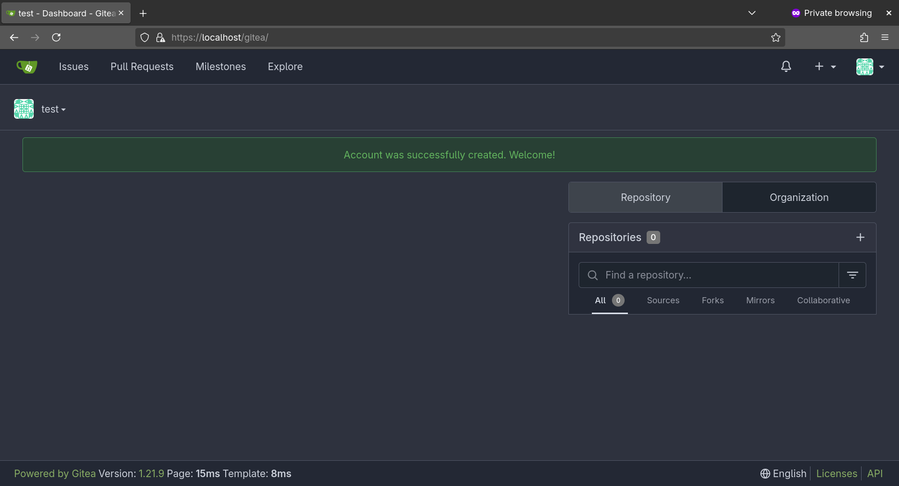

# Inception
The main goal of this project is to learn and utilize the Docker technology. It involves setting up an infrastructure containing several different services, each built using the Alpine distro image (instead of using an image for that specific service).

The setup is shown as follows:


The intention of this is to provide an quick setup for a personal website using WordPress, as well as for self-hosting a Git service using Gitea.

Other useful services include:
- NGINX as reverse proxy.
- Adminer as database management web UI.
- Redis for caching.
- FTP server for retrieval/modification of WordPress files.

## Prerequisites
- `make`
- A docker *.env* file containing:
```
# Sample .env file for setup
# WordPress
DOMAIN_NAME=localhost   # Configure your /etc/hosts if this is not localhost.
WORDPRESS_TITLE=Inception
WORDPRESS_ADMIN=root
WORDPRESS_ADMIN_EMAIL=root@inception.com
WORDPRESS_USER=test
WORDPRESS_USER_EMAIL=test@inception.com

# MariaDB
MARIADB_USER=test
MARIADB_WORDPRESS_NAME=WordPress

# FTP Server
FTP_USER=test
```
- A secrets directory containing (the file directory and names can be changed in `docker-compose.yml` and also `Makefile`):

    1) `ftp_password`: password for FTP user
    2) `gitea-server.rsa.crt` and `gitea-server.rsa.key`: Gitea TLS certificate and key
    3) `mariadb_password` and `mariadb_root_password`: passwords for MariaDB user and root, respectively.
    4) `nginx-server.rsa.crt` and `nginx-server.rsa.key`: NGINX TLS certificate and key
    5) `ssh_key` and `ssh_key.pub`: SSH private and public keys for Gitea.
    6) `wordpress_user_password` and `wordpress_admin_password`: passwords for WordPress user and admin, respectively.

## How to run
1) Place your secrets in the root directory of the project and environment file in the directory where `docker-compose.yml` is located.
2) Run `make`.
3) Access the website using the domain name specified in `.env` (URI path can be changed in `nginx.conf`):
    - `https://localhost` for WordPress.
    - `https://localhost/gitea` for Gitea.
    - `https://localhost/adminer` for Adminer.
4) Optionally run `./Inception` to monitor the container logs.

## Samples
- WordPress homepage

- WordPress user settings

- WordPress admin settings

- Adminer

- Gitea


## Future plans
- Provide a simpler way for configuring (e.g. port numbers, secrets etc.) before and after setup.
- Provide a simpler way for updating service versions.
